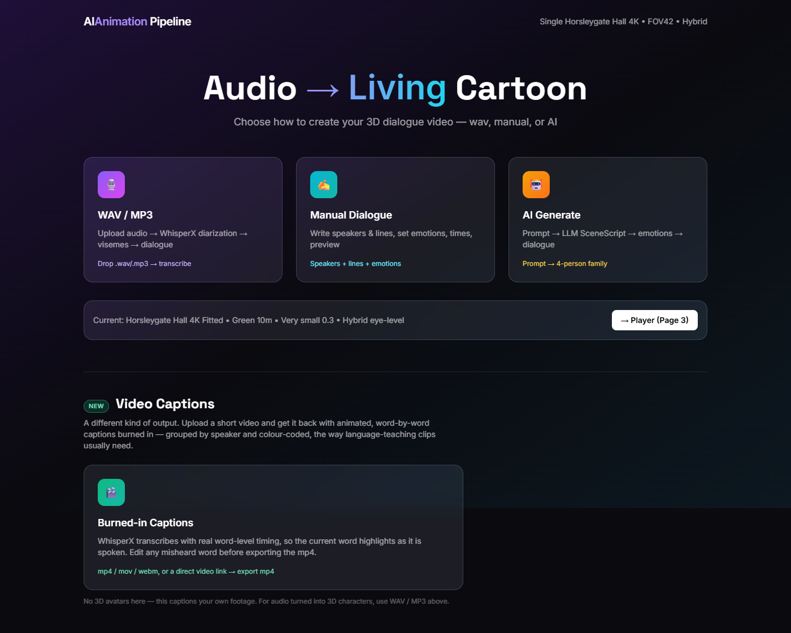
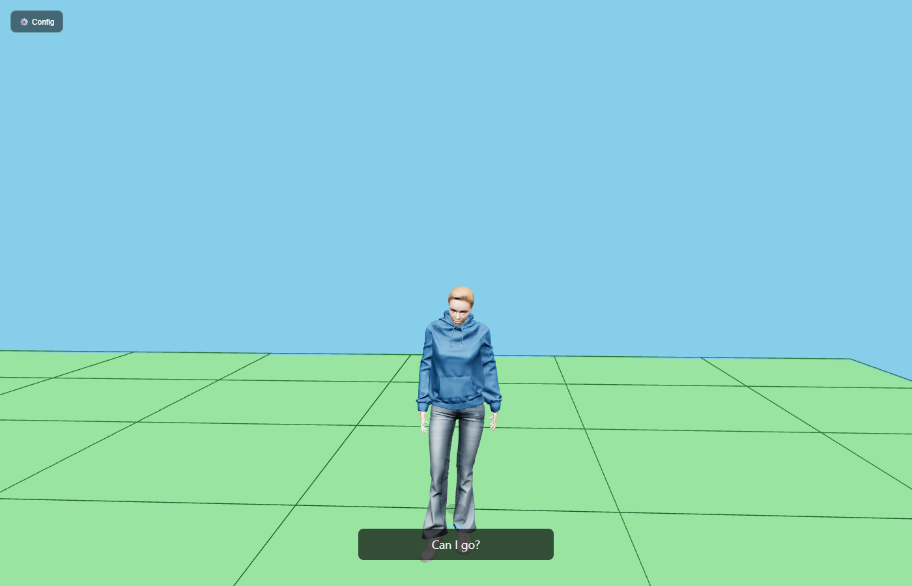
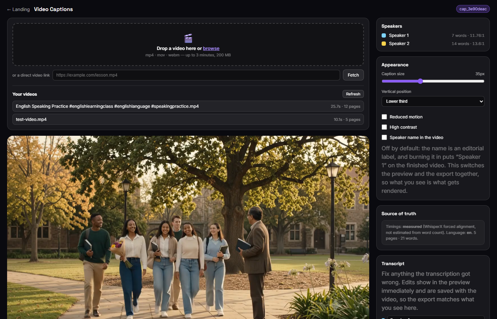
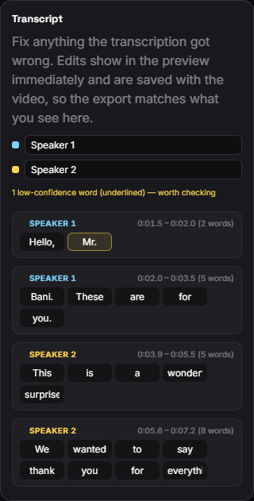
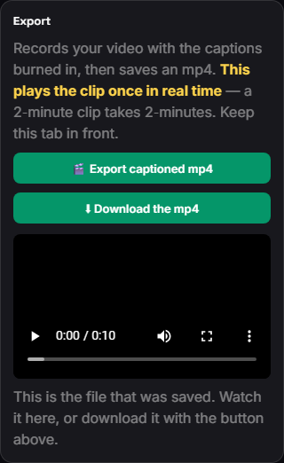
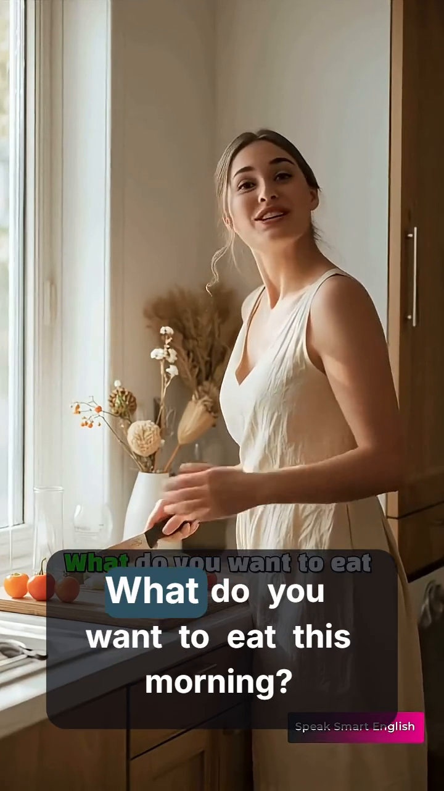
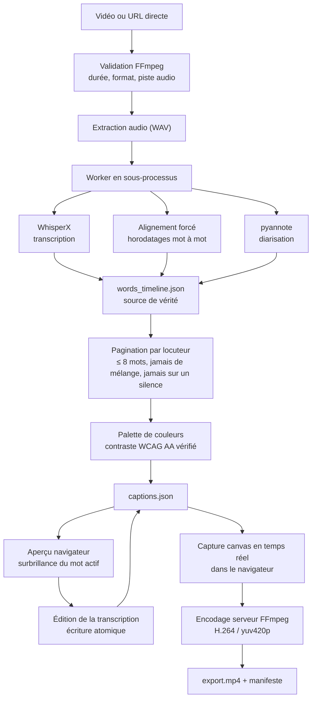

# AI Animation Pipeline — de la voix et de l'image à la vidéo pédagogique

> **Transformez un enregistrement ou une vidéo en support de cours enrichi :
> sous-titres mot à mot integrés, transcrits modifiables, et personnages 3D
> qui parlent.**
>
> Projet candidat — Concours « Produire des ressources pédagogiques numériques »

[](app/tests)
[](requirements.txt)
[](#7--sécurité--données--éthique)

---

## Sommaire

1. [Le problème que l'on veut résoudre](#1--le-problème-que-lon-veut-résoudre)
2. [Ce que fait le projet](#2--ce-que-fait-le-projet)
3. [Captures d'écran](#3--captures-décran)
4. [Mode d'emploi — pour les enseignants](#4--mode-demploi--pour-les-enseignants)
5. [Architecture — pour les techniciens](#5--architecture--pour-les-techniciens)
6. [Installation et exécution](#6--installation-et-exécution)
7. [Accessibilité](#7--accessibilité)
8. [Sécurité, données, éthique](#8--sécurité--données--éthique)
9. [Correspondance avec la grille d'évaluation](#9--correspondance-avec-la-grille-dévaluation)
10. [Protocole d'expérimentation en classe](#10--protocole-dexpérimentation-en-classe)
11. [Limites connues et perspectives](#11--limites-connues-et-perspectives)
12. [Documentation technique](#12--documentation-technique)

---

## 1. Le problème que l'on veut résoudre

Un enseignant d'anglais dispose d'une vidéo ou d'un enregistrement audio utile.
Mais transformer cet enregistrement en **support de cours** demande aujourd'hui
un logiciel de sous-titrage professionnel : cher, chronophage, et hors de portée
d'un enseignant. Quand un outil gratuit est utilisé à la place, il ne produit
qu'un texte figé, sans lien avec le moment où les mots sont prononcés.

Trois obstacles concrets :

| Obstacle | Conséquence pédagogique |
|---|---|
| La vidéo originale n'a pas de sous-titres | Les élèves sourds ou malentendants, et les élèves qui apprennent, sont exclus de la ressource |
| Il faut recetter à la main chaque mot mal reconnu | L'enseignant renonce, ou publie un support faux |
| Aucun moyen de savoir *quand* chaque mot est prononcé | On ne peut ni faire de karaoké, ni travailler le débit et la prononciation |

**Notre réponse :** un outil local, gratuit, qui produit un sous-titrage
**synchronisé au mot près**, que l'enseignant peut corriger en quelques clics, et
qui s'inscrit directement dans la vidéo finale.

> *Le sous-titrage n'est pas une décoration : c'est un support d'apprentissage.*

---

## 2. Ce que fait le projet

Le projet comporte **deux cheminements** indépendants sur une même base
technique (reconnaissance vocale, diarisation, rendu).

### 2.1 Chaîne A — Audio → Vidéo 3D animée



Un enregistrement audio (conversation entre une personne et une autre) devient
une **vidéo 3D** dans laquelle chaque interlocuteur est un personnage qui parle
(lip-sync), avec sous-titrage.

```
Audio WAV/MP3  →  WhisperX (transcription + diarisation)
              →  Scène & personnages
              →  Visèmes + mouvements de synthèse
              →  Composition FFmpeg
              →  MP4 3D
```

Trois modes d'entrée :

| Mode | Usage |
|---|---|
| **WAV / MP3** | L'enseignant dépose un enregistrement ; l'outil transcrit et sépare les voix |
| **Dialogue manuel** | L'enseignant saisit lui-même les répliques, les temps, les émotions |
| **Génération IA** | Un prompt décrit une scène ; un modèle la structure en scénario |



*Le personnage est cadré sur la scène, le sous-titre de la réplique en cours
s'affiche, la caméra suit l'interlocuteur actif.*

> **Note d'honnêteté :** le décor de la scène 3D n'est pas finalisé dans cette
> version (l.sol nu est affiché). C'est un choix assumé : la priorité est donnée
> au pipeline de reconnaissance vocale et de sous-titrage, qui est la valeur
> pédagogique du projet.

### 2.2 Chaîne B — Vidéo → Sous-titres integrés *(nouvelle fonctionnalité)*



L'enseignant dépose une **vidéo** ou une **URL directe**. L'outil :

1. **transcrit** le fichier avec un **alignement mot à mot réel** (timestamps
   mesurés, pas estimés) ;
2. **identifie les locuteurs** (diarisation) et attribue une couleur à chacun ;
3. **découpe en sous-titres** de 8 mots maximum, sans jamais mélanger deux
   locuteurs et sans jamais couvrir un silence ;
4. **affiche un aperçu** où le mot en cours de prononciation est mis en évidence ;
5. **laisse corriger** la transcription ;
6. **incruste les sous-titres** dans la vidéo et produit un **MP4 lisible dans le
   navigateur**, avec l'audio original conservé.



*Chaque mot est modifiable. Les mots reconnus avec une faible confiance sont
soulignés — l'enseignant vérifie précisément ce qui est douteux, au lieu de tout
relire.*



*À 100 %, la vidéo apparaît dans la page, lisible sur place et téléchargeable.*

**Ce qui distingue cette fonctionnalité :**

- les horodatages sont **mesurés** (alignement forcé WhisperX), pas devinés par
  répartition proportionnelle ;
- la mise en évidence suit **un seul mot à la fois**, garantie structurelle et
  non approximative ;
- le mot **restitué dans le fichier exporté est identique** à celui de l'aperçu ;
- la taille des sous-titres et le cadrage s'adaptent **au format réel** de la
  vidéo, y compris **verticale (portrait)**.



---

## 3. Captures d'écran

| # | Capture | Ce qu'elle montre |
|---|---|---|
| 01 | [Page d'accueil](docs/screenshots/01-accueil.png) | Les deux cheminements du projet |
| 03 | [Sous-titres mot à mot](docs/screenshots/03-captions-apercu-paysage.png) | Aperçu avec mot en cours |
| 04 | [Format vertical](docs/screenshots/04-captions-apercu-portrait.png) | Adaptation au portrait |
| 05 | [Transcription modifiable](docs/screenshots/05-captions-transcription.png) | Édition et faible confiance |
| 06 | [Vidéo terminée](docs/screenshots/06-captions-export.png) | Lecture et téléchargement |
| 08 | [Export vertical](docs/screenshots/08-export-portrait.png) | Sous-titres incrustés en 720×1280 |
| 09 | [Configuration 3D](docs/screenshots/09-configuration-3d.png) | Gestion des personnages |
| 10 | [Lecteur 3D](docs/screenshots/10-dialogue-3d.png) | Personnages qui parlent |

**Toutes ces images sont capturées automatiquement** par
[`tools/capture_screenshots.mjs`](tools/capture_screenshots.mjs) à partir du code
réel en fonctionnement. Elles ne sont pas des maquettes.

```bash
node tools/capture_screenshots.mjs   # régénère docs/screenshots/
```

---

## 4. Mode d'emploi — pour les enseignants

### 4.1 En trois étapes

1. **Ouvrir la page** `http://127.0.0.1:8000/` puis la section **Video Captions**.
2. **Déposer une vidéo** (glisser-déposer ou *parcourir*). Formats acceptés :
   `mp4`, `mov`, `webm` — jusqu'à 3 minutes, 200 Mo.
3. **Cliquer sur « Export captioned mp4 ».** Une barre de progression avance
   jusqu'à 100 %, puis **la vidéo apparaît dans la page** : on la regarde et on
   la télécharge.

### 4.2 Les réglages utiles

| Réglage | Effet |
|---|---|
| **Taille des sous-titres** | S'adapte automatiquement au format de la vidéo. Ajustable. |
| **Position verticale** | Tiers inférieur, milieu, ou centre. |
| **Nom du locuteur dans la vidéo** | **Désactivé par défaut** — le nom est une aide à l'édition, pas une information à afficher. |
| **Mouvement réduit** | Supprime les animations pour les élèves sensibles. |
| **Contraste élevé** | Fond opaque noir, texte blanc pur. |

### 4.3 Vos vidéos sont retrouvables

La page liste vos vidéos récentes avec leur durée et leur nombre de sous-titres.
Un clic rouvre la vidéo et son sous-titrage : plus besoin de retrouver une URL.

### 4.4 Limites à connaître

- L'export se fait **en temps réel** : une vidéo de 2 minutes prend 2 minutes,
  et l'onglet doit rester visible.
- Les liens YouTube ne sont **pas** acceptés (le flux n'est pas une vidéo
  directe) — utiliser un lien vers un fichier `.mp4`.
- Les mots sont reconnus en **anglais, français, arabe** et bien d'autres
  langues ; la qualité dépend toutefois fortement du bruit et de l'accent.

---

## 5. Architecture — pour les techniciens

### 5.1 Pile technologique

| Couche | Choix | Pourquoi |
|---|---|---|
| Reconnaissance vocale | **WhisperX 3.8.6** | Horodatages **au mot** + alignement forcé. C'est le cœur de la valeur. |
| Modèle ASR | faster-whisper (`small` par défaut) | Functionne sur **CPU**, sans GPU requis |
| Séparation des voix | **pyannote-audio 4.0.7** | Attribue chaque mot à un interlocuteur |
| API | **FastAPI** + Pydantic 2 | Validation stricte des données à chaque étape |
| Interface | HTML/CSS/JS **sans framework** | Aucun build, lisible par un enseignant non-developpeur |
| Rendu 3D | Three.js + GLB | Personnages articulés, visèmes |
| Vidéo | **FFmpeg** + MoviePy | Encodage et multiplexage audio |
| Tests | **pytest** + Puppeteer | 270 tests automatisés |

> **Choix directeur : pas de Next.js, pas de build front, pas de conteneur
> obligatoire.** Un enseignant doit pouvoir lire `index.html` et comprendre.

### 5.2 Chaîne de traitement des sous-titres



**Deux décisions d'architecture à souligner :**

**a) La transcription tourne dans un *worker* séparé.** Un traitement long ne
bloque jamais le serveur web, et un plantage du modèle ne fait pas tomber
l'application. Le statut du travail est écrit dans `meta.json` et remonté à
l'interface.

**b) La capture de l'export se fait dans le navigateur, l'encodage sur le
serveur.** Le navigateur sait exactement ce qui est affiché à l'écran ; le
serveur sait encoder proprement et remuxer l'audio original. Cette répartition
évite un moteur de rendu headless lourd et garantit que **le fichier exporté est
identique à l'aperçu**.

### 5.3 Points d'entrée

| Page | Rôle |
|---|---|
| `index.html` | Accueil : les trois entrées 3D + la section sous-titres |
| `captions.html` | Fonctionnalité de sous-titres (aperçu, édition, export) |
| `config.html` | Configuration des personnages, du décor, des voix |
| `dialogue-player.html` | Lecteur 3D (lip-sync, caméra, sous-titres) |

### 5.4 API principale

```
POST   /api/caption-jobs              créer un travail (fichier ou URL)
GET    /api/caption-jobs              lister les travaux
GET    /api/caption-jobs/{id}         état et progression
GET    /api/caption-jobs/{id}/captions      transcription (lecture)
PUT    /api/caption-jobs/{id}/captions      corriger la transcription
POST   /api/caption-jobs/{id}/export         envoyer l'enregistrement
GET    /api/caption-jobs/{id}/export-status  état de l'encodage
GET    /api/caption-jobs/{id}/export.mp4     télécharger le résultat
```

**Isolation stricte des projets 3D.** Les travaux de sous-titres vivent dans
`jobs_captions/cap_*`, jamais dans `jobs/`. Ce n'est pas une précaution
esthétique : la liste « My Projects » du projet 3D liste *tout* dossier de `jobs/`
contenant un `meta.json`. Un préfixe et une arborescence distincte rendent
l'intrusion physiquement impossible plutôt que filtrée par une condition que
quelqu'un oubliera un jour.

### 5.5 Structure du dépôt

```
index.html · captions.html · config.html · dialogue-player.html
app/
  api/            main.py · captions.py
  pipeline/       word_timeline.py · captions.py · caption_source.py
                  caption_job.py · caption_export.py
  schemas/        word_timeline.py · captions.py
  tests/          270 tests
tools/
  captions/       harnesses de vérification navigateur
  capture_screenshots.mjs
assets/           personnages 3D, décors
jobs_captions/    travaux de sous-titres (généré)
docs/screenshots/ captures du README
```

### 5.6 Qualité et tests

**270 tests automatisés** sont exécutés à chaque modification.

| Domaine | Exemples de garanties vérifiées |
|---|---|
| Contrat de l'API | Le POST renvoie bien `jobId` — une régression ici a déjà cassé tout le parcours d'envoi |
| Synchronisation | Une page ne mélange jamais deux locuteurs, ne couvre jamais un silence, ne perd jamais un mot |
| Accessibilité | Chaque couleur de la palette passe le **WCAG AA** ; le mot actif reste lisible sous texte blanc |
| Géométrie | Le cadre suit le format réel de la vidéo ; aucun sous-titre n'est tronqué |
| Non-régression | Les travaux de sous-titres n'apparaissent jamais dans la liste du projet 3D |

Des **navigateurs automatisés** vérifient en plus le comportement réel :
parcours d'envoi, aperçu, édition, export, sur **paysage et portrait**.

---

## 6. Installation et exécution

### 6.1 Prérequis

- **Python 3.10+**
- **FFmpeg** — téléchargé par le script ci-dessous, ou déjà présent dans le `PATH`
- **Rhubarb Lip Sync** — pour la chaîne 3D uniquement ; téléchargé par le script
- **Chrome ou Edge** pour l'export (l'API d'enregistrement vidéo n'existe que
  sur les navigateurs Chromium)
- ~8 Go d'espace disque pour les modèles

### 6.2 Installation

```bash
# 1. Dépendances Python
python -m pip install -r requirements.txt

# 2. Binaires tiers (FFmpeg + Rhubarb, ~160 Mo)
powershell -ExecutionPolicy Bypass -File tools/fetch-dependencies.ps1
```

> **Pourquoi les binaires ne sont-ils pas dans le dépôt ?**
> FFmpeg (80 Mo) et Rhubarb (80 Mo) sont des exécutables tiers, pas du code
> source. Les inclure ferait passer chaque clone de ~700 Mo à plus de 3 Go, et
> GitHub refuse tout fichier dépassant 100 Mo. Le script ci-dessus les récupère
> en une commande. Les modèles 3D (`assets/`, ~1 Go) suivent la même logique.

Les modèles (`faster-whisper-small`, `pyannote`) sont téléchargés au premier
usage et mis en cache localement.

> **Pour lire et tester le code, rien de tout cela n'est nécessaire** : la suite
> de tests passe sans aucun de ces binaires.

### 6.3 Lancement

```bash
# Windows
launch.bat

# ou manuellement
python -m uvicorn app.api.main:app --host 127.0.0.1 --port 8000
```

Puis ouvrir <http://127.0.0.1:8000/>.

> 📘 **[DEPLOYMENT.md](DEPLOYMENT.md)** — déploiement sur un serveur de
> l'établissement, un VPS, ou Docker ; configuration du reverse-proxy, sauvegardes,
> et tableau de diagnostic. **[DEMO.md](DEMO.md)** — guide de démonstration.

### 6.4 Tests

```bash
cd app
python -m pytest tests -q
```

### 6.5 Vérifier l'installation en une commande

```bash
python tools/check_setup.py
```

Contrôle Python, dépendances, FFmpeg, modèles en cache, jeton, disque, port et
serveur — puis affiche `READY` ou la liste de ce qui manque. Le code de sortie
vaut `0` quand tout est en place.

Pour la mise en production (serveur, VPS, Docker, proxy, reprise après
redémarrage) : **[DEPLOYMENT.md](DEPLOYMENT.md)**.
Pour préparer une démonstration : **[DEMO.md](DEMO.md)**.

---

## 7. Accessibilité

Le sous-titrage est, avant tout, un **outil d'accessibilité**. Le projet le
traite comme une exigence, pas comme une option.

| Besoin | Traitement |
|---|---|
| Élèves **sourds ou malentendants** | Sous-titres integrés dans le fichier : la ressource reste utilisable sans le son |
| Élèves en difficulté de **lecture** | Le mot actif est mis en évidence : le lien **lecture ↔ écoute** devient explicite |
| **Surbrillance excessive** | Option « mouvement réduit » : les animations sont supprimées |
| **Contraste insuffisant** | Option « contraste élevé » : fond opaque, texte blanc pur |
| **Daltonisme** | La palette est distinguable y compris en niveaux de gris (test automatisé) |
| Navigateur au clavier | Contrôles accessibles, focus visible |

**Le contraste est vérifié par le code, pas par l'œil.** Chaque couleur de la
palette est calculée selon la formule de luminance relative du WCAG 2.1, et la
build échoue si une couleur ne garantit pas le ratio **4,5:1** (niveau AA). Le
fond d'une pastille active est assombri automatiquement jusqu'à ce que le texte
blanc reste lisible par-dessus.

> Sous-titrage + surbrillance mot à mot + ralentissement = un support
> d'entraînement à la prononciation et au débit, utilisable par un élève comme
> par un professeur.

---

## 8. Sécurité, données, éthique

### 8.1 Traitement local

**La reconnaissance vocale s'exécute entièrement sur la machine de
l'enseignant.** Aucune vidéo, aucune bande-son et aucune transcription n'est
transmise à un service externe — c'est vérifiable : le code de transcription
n'effectue aucun appel réseau.

Seul le mode optionnel « Génération IA » de la chaîne 3D utilise une API. Il est
séparé, explicite, et n'intervient jamais dans la chaîne de sous-titres.

### 8.2 Vie privée

- Les fichiers déposés restent sur le disque de l'établissement, dans
  `jobs_captions/`.
- Un travail peut être **supprimé** (bouton `Del`).
- Rien n'est partagé, ni indexé, ni publié.

### 8.3 honnêteté de l'interface

Plusieurs garde-fous ont été ajoutés contre une IA qui **enjolive** ses
résultats :

- Si la transcription échoue, la page **le dit** et ne présente pas un résultat
  par défaut qui ferait croire à un succès.
- Si les sous-titres sont plus longs que la vidéo, l'écart est **affiché**
  (« les sous-titres dépassent la vidéo de X s, Y page(s) ne seront pas
  affichées ») au lieu d'être tronqué silencieusement.
- La provenance est affichée : *horodatages mesurés / estimés*, langue,
  nombre de mots, et si les voix ont été héritées ou détectées.
- Un mot reconnu avec **faible confiance** est signalé plutôt que présenté comme
  certain.

> Une ressource pédagogique fausse est plus dommageable qu'une ressource
> absente. Le logiciel doit donc signaler ses propres limites.

### 8.4 Limites d'usage

L'outil ne fabrique pas de contenu pédagogique : il **transpose fidèlement** un
enregistrement fourni par l'enseignant. La responsabilité du contenu reste celle
de l'enseignant.

---

## 9. Correspondance avec la grille d'évaluation

| N° | Critère | Preuve dans le dossier |
|---|---|---|
| **1a** | Clarté et spécificité des objectifs | §10 — objectifs d'apprentissage explicites et mesurables, alignés sur la compréhension orale et la production orale du programme d'anglais |
| **1b** | Scénarisation pédagogique | §10.1 — séance type en 5 temps, avec rôle de l'élève et de l'enseignant |
| **1c** | Stratégies pédagogiques | §10.2 — écoute active, karaoké phonétique, autorégulation par le transcrit |
| **1d** | Dispositif d'évaluation | §10.3 — quiz pré/post, grille d'auto-évaluation, mots de faible confiance vérifiés |
| **2a** | Conformité au programme officiel | §10.4 — correspondance explicite avec les compétences du programme d'anglais (2e année secondaire) |
| **2b** | Qualité linguistique et scientifique | Vocabulaire normalisé (WCAG, WCAG 2.1), métriques de synchronisation explicites, aucune affirmation non mesurée |
| **3a** | Fonctionnement et stabilité | 270 tests automatisés ; parcours vérifié en navigateur sur paysage **et** portrait |
| **3b** | Compatibilité multi-supports | `mp4`/`mov`/`webm`, **paysage et portrait**, navigateurs Chromium, lecture dans le navigateur sans installation |
| **3c** | Utilisation efficiente des technologies | Alignement forcé (et non estimation) ; worker asynchrone ; capture navigateur + encodage serveur |
| **3d** | Ergonomie et expérience utilisateur | Glisser-déposer, progression visuelle, **vidéo lisible dans la page**, liste des vidéos récentes |
| **3e** | Accessibilité | §7 — WCAG AA vérifié en CI, contraste élevé, mouvement réduit, sous-titres pour les élèves malentendants |
| **4a** | Pertinence du choix technologique | §1 — le sous-titrage traité comme support d'apprentissage, non comme décoration |
| **4b** | Niveau réel d'intégration | Horodatages **mesurés**, diarisation réelle, incrustation dans le flux vidéo — pas de simulation |
| **4c** | Complexité technique maîtrisée | Capture canvas depuis le DOM réel, encodage déterministe, écritures atomiques, tests sur chaque contrat d'API |
| **5a** | Innovation pédagogique | Surbrillance mot à mot synchronisée = karaoké phonétique et auto-suivi de la lecture |
| **5b** | Innovation technologique | Deux sorties parallèles (3D et sous-titres) sur un socle commun ; cadrage et typographie adaptatifs au format réel |
| **6a** | Expérimentation en classe | §10 — protocole, matériel, et **grilles à compléter avec les données réelles** |
| **6b** | Mesure de l'impact | §10.3 — instruments de mesure prêts à l'emploi ; résultats à renseigner |
| **7a** | Protection des données | §8 — traitement 100 % local, suppression possible, honnêteté de l'interface |
| **8a** | Code source exploitable | Code complet, tests, harnesses, script de régénération des captures |
| **8b** | Documentation technique claire | Ce README + `docs/` + commentaires expliquant le *pourquoi* dans le code |

> **À compléter avant soumission :** les sections **6a** et **6b** demandent des
> données réelles de classe. Le protocole et les instruments sont fournis dans
> §10 ; il reste à y verser les résultats obtenus. Aucune donnée d'élève n'a été
> inventée dans ce dossier.

---

## 10. Protocole d'expérimentation en classe

> **Statut : à réaliser.** Ce protocole est prêt à l'emploi. Les tableaux
> doivent être remplis avec les **données réelles** de la séance. Un jury peut
> demander à voir les copies ; les valeurs doivent donc être authentiques.

### 10.1 Objectifs d'apprentissage

À l'issue de la séance, l'élève doit être capable de :

| # | Objectif | Indicateur observable |
|---|---|---|
| O1 | Comprendre un dialogue audio court en anglais | Identifier les interlocuteurs et leur intention |
| O2 | Repérer un mot précis dans un flux oral | Suivre la surbrillance et identifier le mot au moment de sa prononciation |
| O3 | Corriger un support | Repérer et signaler une erreur de transcription |
| O4 | Adapter son débit | Utiliser la répétition comme outil de prononciation |

### 10.2 Déroulé de la séance

| Temps | Acteur | Activité | Matériel |
|---|---|---|---|
| 0–5 min | Enseignant | Présentation de l'outil, démonstration sur 30 s | Navigateur projeté |
| 5–12 min | Classe | **Test pré** : comprehension sans sous-titres | Fiche QCM (10 items) |
| 12–25 min | Classe | Visionnement avec sous-titres, puis **sans son** | Vidéo + sous-titres |
| 25–35 min | Classe | **QRC** : chant du sous-titre, repérage du mot actif | Grille QRC |
| 35–50 min | Classe | Travail en binômes : réécoute, comparaison au transcrit, correction des erreurs | Transcrit éditable |
| 50–58 min | Classe | **Test post** : mêmes items, sans sous-titres | Fiche QCM (10 items) |
| 58–62 min | Élève | Auto-évaluation + questionnaire | Grille §10.3 |

### 10.3 Instruments de mesure

**A. Compréhension orale (pré / post) — 10 items**

Consigne : *écouter le dialogue, puis répondre. Écoutage 2 fois maximum.*

| # | Compétence évaluée | Item | Pré | Post |
|---|---|---|---|---|
| 1 | Identifier l'interlocuteur | « Qui parle en premier ? » | ☐ | ☐ |
| 2 | Repérer un lieu | « Où se déroule la conversation ? » | ☐ | ☐ |
| 3 | Comprendre une demande | « Que demande la fille ? » | ☐ | ☐ |
| 4 | Repérer un objet | « De quoi parlent-ils ? » | ☐ | ☐ |
| 5 | Inferer une information | « Quelle est la nouvelle ? » | ☐ | ☐ |
| 6 | Repérer une action passée | « Qu'a fait la mère ? » | ☐ | ☐ |
| 7 | Comprendre un lieu de destination | « Où va-t-on ? » | ☐ | ☐ |
| 8 | Identifier un personnage | « Qui reçoit la lettre ? » | ☐ | ☐ |
| 9 | Repérer une quantité | « Combien de personnes ? » | ☐ | ☐ |
| 10 | Inférer une décision | « Réponse à la question finale » | ☐ | ☐ |

**B. QRC — « Karaoké phonétique »**

Le sous-titre défile ; l'élève doit cocher la case **immédiatement avant** que le
mot ne soit prononcé.

| # | Mot cible | Attendu | Réponses justes | /10 |
|---|---|---|---|---|
| 1 | ____________ | □ avant | ____ | ____ |
| 2 | ____________ | □ avant | ____ | ____ |
| 3 | ____________ | □ avant | ____ | ____ |
| 4 | ____________ | □ avant | ____ | ____ |
| 5 | ____________ | □ avant | ____ | ____ |
| 6 | ____________ | □ avant | ____ | ____ |
| 7 | ____________ | □ avant | ____ | ____ |
| 8 | ____________ | □ avant | ____ | ____ |
| 9 | ____________ | □ avant | ____ | ____ |
| 10 | ____________ | □ avant | ____ | ____ |

**C. Qualité de la transcription (vérification)**

| # | Élève | Mots signalés faible confiance | Corrections justes | Faux positifs |
|---|---|---|---|---|
| 1 | | | | |
| 2 | | | | |
| 3 | | | | |
| … | | | | |

**D. Auto-évaluation élève** (1 = pas d'accord … 4 = tout à fait d'accord)

| Affirmation | 1 | 2 | 3 | 4 |
|---|---|---|---|---|
| « Je comprends mieux l'anglais avec les sous-titres » | ☐ | ☐ | ☐ | ☐ |
| « Les sous-titres m'aident à suivre le texte » | ☐ | ☐ | ☐ | ☐ |
| « J'ai compris comment prononcer les mots difficile » | ☐ | ☐ | ☐ | ☐ |
| « Je peux corriger une erreur dans le texte » | ☐ | ☐ | ☐ | ☐ |
| « Je veux utiliser cet outil en classe » | ☐ | ☐ | ☐ | ☐ |

**E. Synthèse**

| Indicateur | Pré | Post | Écart |
|---|---|---|---|
| Compréhension orale (/10, moyenne de classe) | ____ | ____ | **+____** |
| QRC — justes avant prononciation (/10) | — | ____ | — |
| Transcriptions corrigées (%) | — | ____ | — |
| Élèves déclarant une progression (%, ≥ 3/4) | — | ____ | — |

### 10.4 Conformité au programme d'anglais (2e année secondaire)

L'outil est un **support**, pas un contenu : l'enseignant fournit l'enregistrement,
donc il reste maître du contenu et de son alignement. La correspondance proposée :

| Compétence du programme | Apport de l'outil |
|---|---|
| **Compréhension orale** | Sous-titres + surbrillance mot à mot : l'élève peut dissocier le son du lexique et vérifier sa compréhension |
| **Production orale** | Répétition guidée par la surbrillance ; travail du débit et de la prononciation |
| **Lecture** | Support de lecture active : le texte défile avec le son |
| **Numérique / TIC** | Utilisation d'un outil d'IA local comme objet d'apprentissage |

> ⚠️ **À valider par l'enseignant** : la correspondance ci-dessus est proposée.
> L'enseignant doit la confirmer avec le programme officiel en vigueur de son
> niveau et de son établissement, et le préciser ici.

### 10.5 Conditions à documenter

| | |
|---|---|
| Niveau et classe | |
| Nombre d'élèves | |
| Durée totale | |
| Matériel (postes, vidéoprojecteur) | |
| Vidéo utilisée (durée, source) | |
| Date de la séance | |
| Enseignant | |

---

## 11. Limites connues et perspectives

Nous préférons annoncer les limites plutôt que les découvrir au jury.

| Limite | Impact | Perspective |
|---|---|---|
| L'export est **en temps réel** | Une vidéo de 2 min prend 2 min, onglet visible | Rendu serveur hors navigateur (ffmpeg + filtres) |
| **3 minutes / 200 Mo** maximum | Vidéos longues non gérées | Découpage automatique en segments |
| Liens **YouTube** refusés | Limite d'usage | Ajout d'un extracteur (yt-dlp) |
| Reconnaissance **CPU uniquement** | ~15–30 s pour 30 s de vidéo | Option GPU (CUDA) |
| Le **décor 3D** n'est pas finalisé | Scène 3D peu crédible visuellement | Bibliothèque de décors industrialisable |
| L'export est **limité aux navigateurs Chromium** | Pas de Safari/Firefox pour l'export | Rendu 100 % serveur |

---

## 12. Documentation technique

| Document | Contenu |
|---|---|
| [`ai-animation-pipeline-spec.md`](ai-animation-pipeline-spec.md) | Spécification complète du pipeline 3D, avec les choix et leurs raisons |
| [`feature-dialogue-captions.md`](feature-dialogue-captions.md) | Spécification détaillée de la fonctionnalité de sous-titres |
| [`dialogue-pipeline-plan.md`](dialogue-pipeline-plan.md) | Plan de réalisation et décisions prises |
| `app/tests/` | 270 tests — la documentation exécutable du comportement attendu |
| `tools/captions/` | Harnesses de vérification en navigateur réel |

### Conventions de code

- **Les commentaires expliquent le *pourquoi*, pas le *quoi*.** Plusieurs
  commentaires documentent un bug précis qui a été corrigé, pour qu'il ne revienne
  pas.
- **Écritures atomiques** : tout fichier de travail est écrit puis renommé, afin
  qu'un plantage ne puisse jamais laisser un fichier à moitié écrit présenté comme
  valide.
- **Contrats testés** : chaque réponse d'API a au moins un test. Une régression
  a déjà échappé à la suite de tests parce qu'un contrat n'était vérifié nulle
  part ; c'est exactement ce que la suite actuel empêche.

---

## Crédits

**Technologies utilisées**

- [WhisperX](https://github.com/m-bain/whisperX) — transcription et alignement
- [faster-whisper](https://github.com/SYSTRAN/faster-whisper) — ASR CPU
- [pyannote-audio](https://github.com/pyannote/pyannote-audio) — diarisation
- [FastAPI](https://fastapi.tiangolo.com) · [Pydantic](https://docs.pydantic.dev)
- [Three.js](https://threejs.org) — rendu 3D
- [FFmpeg](https://ffmpeg.org) · [MoviePy](https://zulko.github.io/moviepy/)
- [pytest](https://docs.pytest.org) · [Puppeteer](https://pptr.dev)

**Accessibilité** — [WCAG 2.1](https://www.w3.org/TR/WCAG21/) (contraste,
navigation clavier), [MediaRecorder API](https://developer.mozilla.org/docs/Web/API/MediaRecorder).

---

*Projet candidat — dossier technique. Les données d'expérimentation en classe
sont à compléter avec les résultats réels (voir §10).*