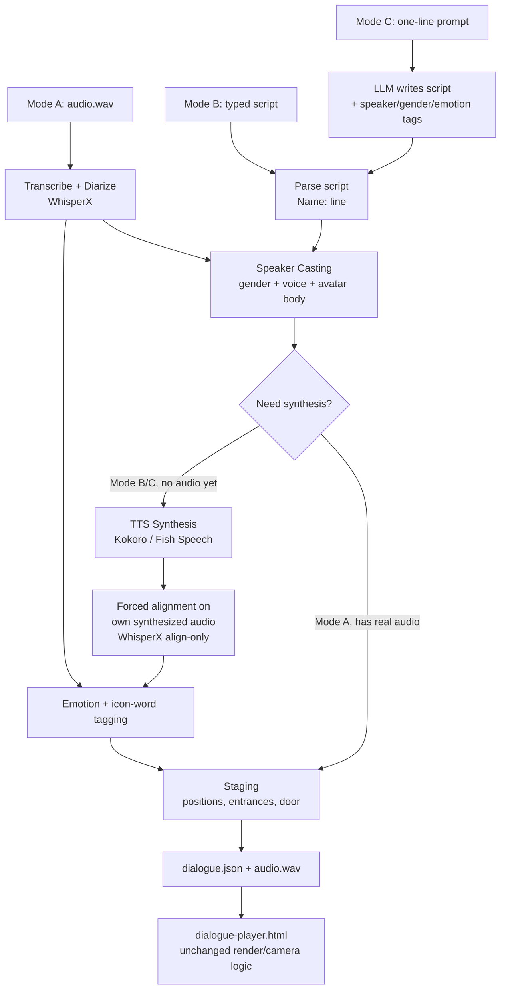

  # AI Dialogue Video Pipeline — Implementation Plan

This document is the spec for automating the existing `dialogue-player.html`
(Three.js + TalkingHead, camera-tween system already implemented) with a
pipeline that produces its inputs — `dialogue.json` + an audio file —
automatically from three different entry points. It's written to be handed to
OpenCode as a working plan: drop it in the repo root (e.g. `PIPELINE.md`,
referenced from `AGENTS.md`), and work through the checklist in §9 phase by
phase.

## 0. Goal

One command, three possible starting points, same output:

```
pipeline from-audio   my_recording.wav        --out jobs/run123
pipeline from-script  my_script.txt           --out jobs/run123
pipeline from-prompt  "two kids arguing over a video game" --out jobs/run123
```

...all three end at `jobs/run123/dialogue.json` + `jobs/run123/audio.wav`,
loadable by the existing player.

## 1. The Three Input Modes

**Mode A — Real audio.** User uploads an MP3/WAV. Pipeline transcribes,
diarizes (who spoke when), and casts each detected voice onto an RPM avatar.

**Mode B — Typed script.** User types a script directly, using a simple
`Name: line` convention. Pipeline parses speakers, has the user (or an
auto-classifier) assign gender/voice/avatar per new name, synthesizes audio
with TTS, and gets real word-timing by running forced alignment on its own
synthesized audio.

**Mode C — LLM-generated.** User gives a one-line premise. An LLM writes the
full script *and* tags speaker name/gender/emotion per line in one structured
call — this skips a separate classification step entirely, since the model
that's writing the line already knows who's saying it and how. From there it
shares Mode B's TTS/staging pipeline.

## 2. High-Level Architecture



Everything downstream of "Speaker Casting" is shared by all three modes —
that's the entire point of funneling them into one shape early.

## 3. Repo / Folder Layout

```
pipeline/
  cli.py                  # entrypoint, 3 subcommands
  stages/
    transcribe_diarize.py # Mode A: WhisperX
    parse_script.py       # Mode B: "Name: line" -> turns[]
    generate_script.py    # Mode C: LLM -> turns[] (calls parse_script's schema directly)
    cast_speakers.py      # gender/voice/avatar assignment (shared)
    synthesize_tts.py     # Kokoro / Fish Speech (Mode B/C only)
    align_audio.py         # WhisperX align-only, reused from Mode A's dependency
    tag_mood.py            # emotion + icon keywords (shared)
    stage_scene.py          # positions, walk-ins, entrance order (shared)
    assemble.py             # writes final dialogue.json (shared)
  catalog/
    avatars.json           # RPM GLB pool, tagged by the 4 role archetypes
                             # already in use: girl/woman/man/boy
                             # (assets/woman.glb, woman1.glb, man.glb, man1.glb)
    voices.json            # Kokoro/Fish voice IDs, tagged gender/accent
  jobs/
    <run_id>/
      raw_input.*            # original upload or typed text
      turns.json              # intermediate: [{speaker,text,gender,emotion,...}]
      cast.json                # intermediate: speaker -> {avatarUrl, body, voiceId}
      dialogue.json            # final, player-ready
      audio.wav                # final, player-ready
apps/
  dialogue-player.html      # existing player — needs ONE small change, see §5.7
```

Every stage reads one JSON from `jobs/<run_id>/` and writes the next — that
makes each stage independently re-runnable and inspectable by hand, which
matters a lot here since casting/staging choices are exactly the kind of
thing you'll want to eyeball and tweak between stages rather than trust
blindly.

## 4. Data Contracts

### 4.1 `turns.json` — output of Mode A/B/C's first stage, input to Casting

```json
[
  { "speaker": "Dad", "text": "Are you kidding me right now?", "gender": "M",
    "age": "adult", "emotion": "annoyed", "start": 1.63, "end": 3.20 }
]
```

`age` matters as much as `gender` here: the existing avatar set is 4 role
archetypes, not 2 — girl (child F), woman (adult F), man (adult M), boy
(child M) — so casting needs to resolve both axes, not gender alone.

`start`/`end` are only known for Mode A (from diarization); Mode B/C leave
them null — they get filled in during TTS+alignment instead.
`gender`/`emotion` are always present: Mode A gets them from the casting
classifier + text-emotion model (§5.4/§5.5), Mode C gets them for free from
the LLM's structured output, Mode B gets emotion from the same text-emotion
model Mode A uses (no audio to read gender from, so that part is the one
manual-confirm step Mode B can't skip).

### 4.2 `cast.json` — output of Casting stage

```json
{
  "Dad": { "avatarUrl": "assets/man.glb", "body": "M",
           "voiceId": "kokoro:am_adam", "lipsyncLang": "en" }
}
```

### 4.3 `dialogue.json` — final, exactly the schema the player already reads

This is reverse-engineered from `dialogue-player.html`'s own consumption
code (`doorForSpeaker`, `isPresent`, `entranceOrder[0]`, `walkins[]`,
`speakers[id].position/rotation/avatarUrl/body/lipsyncLang/name`,
`segments[].speaker/start/end/text/words/wtimes/wdurations/mood/go_label/
clip/lipsyncLang`) — match it exactly, no schema changes needed on the
player side:

```json
{
  "speakers": {
    "SPEAKER_00": { "name": "man", "avatarUrl": "assets/man.glb",
                     "body": "M", "position": {"x":0,"y":0,"z":0.85},
                     "rotation": 0.937, "lipsyncLang": "en" }
  },
  "segments": [
    { "speaker": "SPEAKER_00", "start": 1.63, "end": 3.20,
      "text": "Are you kidding me right now?",
      "words": ["Are","you","kidding","me","right","now?"],
      "wtimes": [0, 180, 340, 620, 780, 990],
      "wdurations": [160, 150, 260, 140, 190, 220],
      "mood": "annoyed", "go_label": "annoyed",
      "clip": "media/3d/mixamo/clips/Standing Arguing.fbx",
      "lipsyncLang": "en" }
  ],
  "walkins": [ { "speaker": "SPEAKER_02", "t0": 6.40, "t1": 7.63,
                 "gap": 1.23, "door": {"x":0.85,"z":1.4} } ],
  "entranceOrder": ["SPEAKER_00", "SPEAKER_01", "SPEAKER_02"],
  "presentTimeline": [ { "speaker": "SPEAKER_00", "firstStart": 1.63 } ],
  "door": {"x": 0, "z": 2.0, "auto": true}
}
```

`wtimes` are milliseconds **relative to the segment's own start** (the
player does `setTimeout(..., t)` inside a callback already scheduled at
`seg.start*1000`) — easy stage to get subtly wrong, worth a unit test.

Two things worth calling out from a real reference file (`jobs/dialogue.json`
in the wild, generated for a 4-speaker "man/woman/girl/boy" scene): each
`walkins[]` entry's `door` is **not** a single global point — it's offset
from *that speaker's own* assigned stage `position`, further out along the
entrance axis (e.g. a speaker staged at `z:0.85` gets a door around
`z:2.39` — roughly 1.5m further along the same line). Compute it per-speaker
at staging time, not as one shared constant. `gap` (present on every
`walkins[]` entry) is just `t1 - t0` restated for readability — the player
never reads it, so it's optional to emit but harmless to keep.
`presentTimeline` (`speaker` + `firstStart` per speaker) likewise isn't
referenced anywhere in the player's JS — it looks like a derived
debug/authoring field from whatever tool produced that file. Fine to emit
for your own tooling, but don't treat it as something Stage 8 depends on.

## 5. Pipeline Stages

### 5.1 Mode A — Transcribe + Diarize

**Tool: WhisperX** (bundles faster-whisper + pyannote.audio 3.1/community-1
+ wav2vec2 forced alignment in one library). This is the standard open-source
combo for this exact job in 2026 — one `pip install whisperx`, word-level
timestamps and speaker labels in a single pass, no need to hand-stitch
Whisper and pyannote yourself.

```python
import whisperx
model = whisperx.load_model("large-v3", device="cuda")
result = model.transcribe("audio.wav")
diarize_model = whisperx.DiarizationPipeline(use_auth_token=HF_TOKEN)
diarize_segments = diarize_model("audio.wav")
result = whisperx.assign_word_speakers(diarize_segments, result)
```

Group consecutive same-speaker words into turns to build `turns.json`
(absolute `start`/`end` here — converted to segment-relative `wtimes` in
§5.7's assemble step, not here).

### 5.2 Mode B — Parse Typed Script

Convention: one line per turn, `Name: text`. Optional inline mood tag:
`Dad [annoyed]: Are you kidding me right now?`. Regex is enough:

```python
import re
LINE = re.compile(r'^([\w\s]+?)(?:\s*\[(\w+)\])?:\s*(.+)$')
```

If a paragraph doesn't match the convention at all, fall back to sending the
raw text through Mode C's structured-generation call instead of writing a
second, different parser — one LLM-based "make this into turns" path covers
both "free-form paragraph" and "generate from scratch."

First-appearance order of each name becomes `entranceOrder`.

### 5.3 Mode C — LLM-Generated Script

Single structured call, e.g. Claude Sonnet 5 via the Messages API, forced to
emit only JSON matching `turns.json`'s Mode-C-populated fields (speaker,
gender, emotion, text) in one shot — no separate gender/emotion
classification needed afterward, since the model that wrote the line already
knows both. Use `claude-haiku-4-5-20251001` for cheap draft iteration,
`claude-sonnet-5` for the version you'll actually render.

Feed the result straight into Mode B's downstream stages — Mode C is really
just "Mode B's parser, fed by a model instead of a keyboard."

### 5.4 Speaker Casting (shared)

For every new speaker name, resolve `{avatarUrl, body, voiceId}` against
both gender **and** age-class, since the avatar pool is 4 role archetypes
(girl/woman/man/boy), not 2:

- **Mode A (real voices exist):** run a lightweight gender+age classifier
  on each speaker's audio (e.g. a pretrained wav2vec2 age/gender head) as a
  *suggestion*, then show the user a 3-second clip + the suggestion and let
  them confirm or override before picking an avatar from `catalog/
  avatars.json`. Don't auto-commit — this decision also picks which RPM body
  mesh loads, and a wrong guess is annoying to catch later.
- **Mode B (typed, no audio):** no signal to classify from, so this is the
  one place manual input is required, not just recommended — ask for
  gender + age-class per new name once and cache it.
- **Mode C (LLM):** gender/age came free with the script (the structured
  call in §5.3 should emit `age` alongside `gender`); just round-robin an
  avatar and a matching voice ID from the catalogs so repeat speakers of
  the same archetype don't all get an identical voice/face.

### 5.5 TTS Synthesis (Mode B/C only)

- **Default:** Kokoro-82M — CPU-friendly, MIT-licensed, 54 built-in voices
  pre-tagged by gender/accent, no cloning needed for generated dialogue.
- **When a specific voice/cloned reference matters:** Fish Speech
  (Apache-2.0, commercially clean) or XTTS v2 (community fork; CPML license
  — non-commercial only) for cloning from a short reference clip.

Synthesize one WAV per turn, concatenate with small inter-turn gaps
(250–400ms, tune to taste) via `pydub`/`ffmpeg`, loudness-normalize
(`ffmpeg -af loudnorm`) so speakers don't vary wildly in level.

### 5.6 Forced Alignment on Synthesized Audio

Neither Kokoro nor Fish Speech gives word-level timestamps natively. Rather
than estimating them (the player's own `estimateWordData()` fallback is a
rough proportional guess, fine as a last resort but not as good as real
data), run WhisperX in **align-only mode** on the audio you just
synthesized — you already know the exact text, so this is just forced
alignment, not transcription, and it's fast and free of ASR error:

```python
result = whisperx.align(known_transcript_segments, align_model, metadata,
                         "synthesized_audio.wav", device)
```

This is the same dependency Mode A already needs, reused for a different
purpose — no new library.

### 5.7 Mood + Icon Tagging (shared)

- **Mode A/B:** run each segment's text through a text-emotion classifier
  (`SamLowe/roberta-base-go_emotions` — note this matches the `go_label`
  field name already present in the existing player code, so use its label
  set directly rather than inventing a new one).
- **Mode C:** the LLM already tagged emotion per turn in §5.3 — normalize
  it into the same go_emotions label set and skip the classifier call.
- **Icon words** (the existing `icons.json`/word-overlay feature): either a
  simple keyword-spotting pass against `tools/icons/dictionary.json`'s
  existing keys, or ask the Mode C LLM call to also name one keyword per
  turn plus its word index, so `wtimes[index]` gives you the icon's timing
  for free.

### 5.8 Staging (shared)

- **Positions:** reuse the existing box-corner assignment logic
  (`applyBoxSpots`'s 4-corner convention) for ≤4 speakers. Flag as a v2 item
  if you ever need 5+.
- **Entrance order:** order of first appearance in `segments`.
- **Walk-ins:** for every speaker after the first, auto-generate a
  `walkins[]` entry: `door` = that speaker's own assigned stage `position`
  pushed further out along the entrance axis (~1.5m, matching the reference
  file's convention — not a single shared point), `t0` = first-line-start
  − 1.2s, `t1` = first-line-start − 0.1s, `gap` = `t1 - t0` (informational
  only). This reuses `startWalkLerp`/`updateWalkCamera` in the player
  completely unchanged.

### 5.9 Assemble + a required one-line player change

Write the final `dialogue.json` per §4.3, copy/point at the audio file.

**Player change needed:** today `dialogue-player.html` hardcodes
`fetch('jobs/dialogue.json')` and `fetch('jobs/full_mono_london.wav')` — fine
for one hand-tuned scene, not for a pipeline producing many runs. Add:

```js
const jobId = new URLSearchParams(location.search).get('job') || 'default';
const r = await fetch(`jobs/${jobId}/dialogue.json`);
...
const ar = await fetch(`jobs/${jobId}/audio.wav`);
```

That's the only change required on the render side — everything else
(camera tweens, lip-sync, staging, recording) already works as-is.

## 6. Orchestrator CLI

Plain Python, three subcommands sharing everything past `turns.json`:

```
pipeline from-audio  <path> --out jobs/<id>
pipeline from-script <path> --out jobs/<id>
pipeline from-prompt "<premise>" --out jobs/<id>
```

Each stage is a pure function: read one JSON from `jobs/<id>/`, write the
next. That makes every stage resumable and independently testable —
`pipeline resume jobs/<id> --from cast` should just work.

## 7. Tool Picks (current as of this plan)

| Stage | Pick | Why |
|---|---|---|
| ASR + diarization | WhisperX (faster-whisper + pyannote 3.1/community-1) | de facto open-source standard; one library, word timestamps + speaker labels together |
| TTS, no cloning | Kokoro-82M | MIT, CPU-friendly, 54 voices pre-tagged by gender |
| TTS, cloning | Fish Speech (Apache-2.0) or XTTS v2 (CPML, non-commercial) | pick Fish Speech if this is ever commercial |
| Text emotion | SamLowe/roberta-base-go_emotions | label set matches the existing `go_label` field |
| Script generation | Claude Sonnet 5 (quality) / Claude Haiku 4.5 (drafts) | structured JSON output, one call gets speaker+gender+emotion+text together |
| Audio glue | ffmpeg / pydub | concatenation, loudness normalization, gap padding |

## 8. Skills & MCP for OpenCode

- **Write a project skill once you land on working stage commands** —
  `.opencode/skills/audio-pipeline/SKILL.md` documenting the venv setup, HF
  token requirements for pyannote, and each stage's CLI contract, so a
  future OpenCode session doesn't re-derive all of this from scratch. Anthropic's own `skill-creator` pattern (already in this account's example
  skills) is a fine template for how to structure it.
- **Up-to-date docs MCP (e.g. Context7):** WhisperX/pyannote/Kokoro APIs
  shift between versions and are exactly the kind of thing a coding agent
  confidently hallucinates from stale training data — pulling live docs
  during implementation is worth it here specifically.
- **Filesystem/shell:** already native to OpenCode's Build agent, no extra
  MCP needed for local file ops.
- **GitHub MCP (optional):** useful if you want one PR per pipeline stage
  rather than direct commits, given how much of this is "build, listen,
  adjust."
- **Playwright MCP (optional but a good fit here):** lets OpenCode load
  `dialogue-player.html?job=<id>` in a real browser and confirm a generated
  scene actually renders/plays before you review it — this project is
  unusually visual for something a coding agent is building blind.
- **`uv` for the Python side:** WhisperX/pyannote/Kokoro all pull heavy
  torch dependencies; a fast, reproducible venv tool matters more here than
  on a typical web project.

## 9. Build Phases

- **M0 — Infra.** `jobs/<run_id>/` convention, the `?job=` param change to
  `dialogue-player.html` (§5.9), a stub `pipeline.py` with all 3 subcommands
  that just copy a fixture `dialogue.json` — proves the render side
  end-to-end before any ML is involved.
- **M1 — Mode A.** Wire WhisperX, convert its output into `turns.json` →
  `dialogue.json`. No TTS or casting UI needed yet — casting can be a
  hand-edited JSON for this milestone.
- **M2 — Casting.** Build the gender/voice/avatar assignment step
  (auto-suggest + manual confirm) against `catalog/avatars.json` and
  `catalog/voices.json`.
- **M3 — Mode B.** `Name: line` parser, feeds into M2, adds Kokoro TTS +
  the align-only forced-alignment reuse from §5.6.
- **M4 — Mode C.** Prompt template + structured JSON parsing, feeds
  straight into M3's TTS/staging — shares almost everything once a script
  exists.
- **M5 — Mood/icons.** Emotion classifier (or LLM-tag passthrough) +
  icon-keyword tagging.
- **M6 — Staging polish.** Auto entrance-order/walk-ins, and confirm it all
  plays nicely with the camera-tween work already in the player.

## 10. Design & Cinematography Notes

- The camera-tween system (`state.camTween` / `moveCameraTo` /
  `tickCameraTween`, dynamic `seg._camDur`) is already built into the
  player — the pipeline's only job is to keep emitting a normal
  `segments[]` array with realistic start/end gaps; nothing else is needed
  on that front.
- Once emotion tags exist (§5.7), consider feeding them into
  `lightAmbientIntensity`/`lightDirectIntensity` by a small amount (cooler/
  dimmer for sad, warmer for joy) — a cheap mood cue with no new geometry.
- Scale `INTRO_WIDE_MS`/`INTRO_PER_SPEAKER_MS` down as cast size grows past
  3, so the opening intro doesn't drag for bigger casts.
- Keep the player's manual "drag avatar" / "Draw Stage Box" tools around
  for one-off touch-ups after auto-staging — good auto-staging is a solid
  default, not a guarantee of good blocking every time.

## 11. Known Limitations / Open Questions

- The 4-corner stage-box convention is a hard limit today; 5+ speakers
  needs a different layout algorithm (e.g. circle-packing) — treat as v2,
  not a blocker now.
- Mode A speakers already have real voices — decide whether they should
  still get an auto-assigned RPM body by detected gender, or whether you'd
  rather hand-pick avatars per real person per project (recommend keeping
  the manual override available either way).
- Gender/emotion classifiers are never perfect — keep the human-confirm
  step in Casting rather than fully auto-committing, since it also decides
  which avatar mesh loads.
